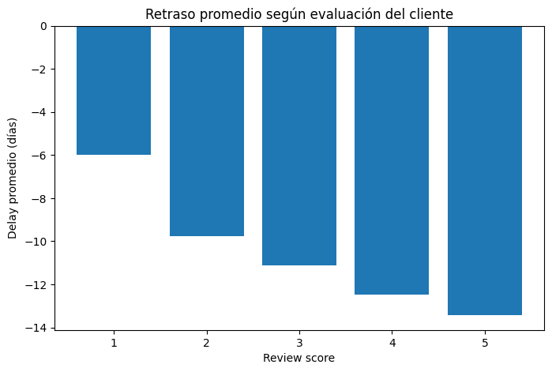

# E-commerce Operational Efficiency Analysis

This project simulates a real-world operational analysis, focusing on delivery performance and customer experience to support data-driven decision making.

## Project Overview

This project analyzes the operational performance of an e-commerce business, focusing on delivery efficiency and its impact on customer satisfaction.

The objective is to identify operational improvement opportunities through data analysis, simulating the work of a Data Analyst in a real business environment.

---

## Objectives

- Evaluate delivery performance and operational efficiency
- Analyze the relationship between delivery time and customer satisfaction
- Identify product categories with potential issues
- Generate data-driven recommendations

---

## Tools & Technologies

- Python (Pandas, NumPy)
- Data Analysis & Cleaning
- Matplotlib for visualization
- SQL-like data joins

---

## Dataset

The analysis is based on the Olist e-commerce dataset, which includes:

- Orders  
- Customers  
- Products  
- Payments  
- Reviews  

---

## Key Analysis

- Creation of operational metrics:
  - Delivery time
  - Delivery delay
- Business metrics:
  - Revenue
  - Total orders
  - Unique customers
- Relationship analysis:
  - Delay vs Customer satisfaction
  - Category vs Performance

---

## Key Insights

- Orders are delivered on average before the estimated date, indicating strong logistical performance.
- Faster deliveries are associated with higher customer satisfaction.
- Customer satisfaction is not solely dependent on delivery time.
- High-volume categories such as *cama_mesa_banho* show lower satisfaction, suggesting quality or experience issues.

---

## Sample Visualization

---

## Recommendations

- Prioritize quality analysis in high-volume, low-satisfaction categories.
- Identify specific products generating poor reviews.
- Improve delivery time estimation accuracy.
- Replicate best practices from high-performing categories.
- Implement continuous monitoring of operational KPIs.

---

## Professional Approach

This project simulates real-world data analysis focused on operational efficiency and decision-making.

---

## Next Steps

- Build dashboards (Power BI / Tableau)
- Analyze performance by region
- Develop predictive models for delays

---

## About Me

Industrial Engineering student focused on data analytics, operational efficiency, and data-driven decision making, with interest in industries such as mining and supply chain.

Currently building a portfolio of data projects focused on real-world business problems.
